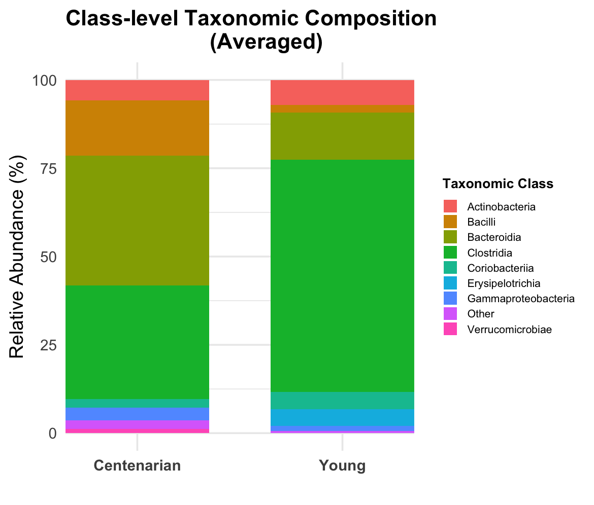
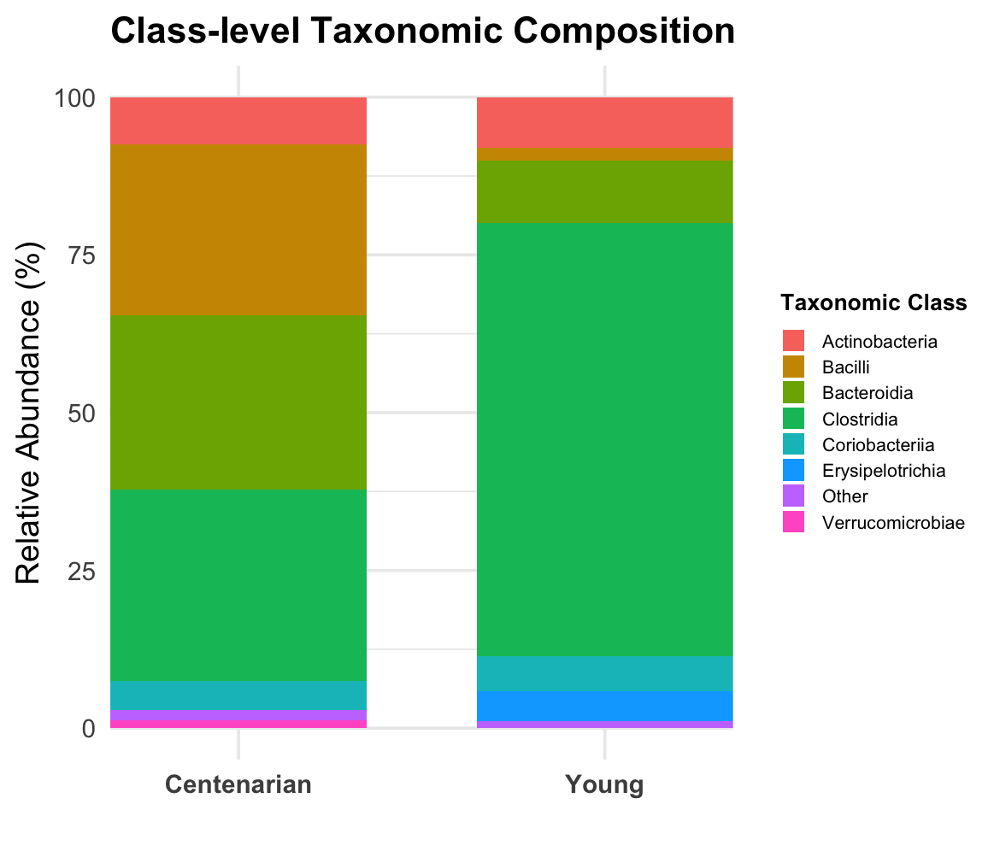
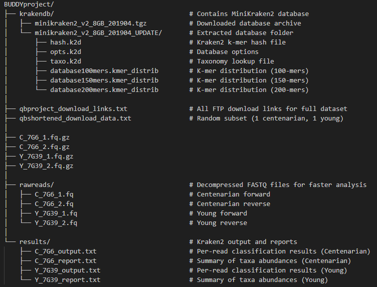

# Check-in 1: Comparative Analysis of Gut Microbiota in Centenarians and Young Populations
### Alan Wang and Carsten Hoeke
---

## Addressing Prior Feedback

Since the initial project proposal and meeting, we have significantly changed our project direction to comparing the gut microbiota between centenarians and younger populations using metagenomic sequencing data. Specifically, there are two reasons for the change in direction. Firstly, although there are numerous datasets that contain centenarian microbiomes and different disease conditions, especially the large dataset from Rob Knight’s lab, the scale and heterogeneity of these repositories made it challenging to isolate and download specific subsets in a reasonable time frame. Second, our earlier design lacked clear biological variables that could yield interpretable results. Therefore, following feedback from instructors, we redirected our project to compare two well-defined biological variables, age groups from different populations in Sardinia, using datasets referenced in a peer-reviewed paper. In addition, we were also advised to use the MiniKraken2 database for classification during our initial pipeline tests, resulting in our first usable pipeline established on shell, Python, and R. These adjustments have provided a clear direction for us to follow in the next phase of our project.

---

## Progress

As we have changed the direction of our project, we have made significant progress in establishing and testing our metagenomic analysis workflow. Excitingly, we have successfully created a reproducible pipeline to go from raw data input to final output using Kraken2 for taxonomic classification. The shell script we developed takes raw pair-end FASTQ files downloaded from the public database and automatically generates per-read classification outputs, summarizing the taxonomic report in a text file within the results directory. From the shell script, we also developed an R script that processes the Kraken2 report files by averaging relative abundance across taxa and quantifies the results as a stacked bar chart (Figure 1). Our preliminary test looks at the microbial distribution across two samples, a young individual and centenarian; however, the sample size is currently limited to (n = 1) per group. Another potential limitation with our stacked bar graph is that it may not display all the taxonomic classes or bacterial species which could potentially skew our analysis, as literature suggests there is a loss of microbiota diversity with an increase in age, leading to dysbiosis.1 Despite our current limitations in the script, our preliminary results demonstrate that the pipeline functions correctly and produces interpretable results. Furthermore, it seems like the observed taxonomic profiles, although we have a very limited sample size, show relative decrease in certain bacterial taxa in centenarians compared to younger people. In the future, we would like to use a larger sample size and extend the taxonomic class to the full Kraken database. In addition, we would also like to create trend lines of several candidate bacteria throughout multiple age cohorts rather than strictly centenarians and young populations, perhaps intermediates.

**Figure 1.** Average Class-level taxonomic composition of gut microbiota in a centenarian and a young individual (n = 3) using Kraken2 classification.

**Figure 2.** Single Class-level taxonomic composition of gut microbiota in a centenarian and a young individual (n = 3) using Kraken2 classification.

---

## Project Organization

Our project repository and pipeline, Biological Understanding of the Dysbiosis and Diversity across Years (BUDDY), is used to organize our directory structure, which separates raw data, processed results, and reference database. The krakendb/ folder has the MiniKraken2 reference database and other associated taxonomy files that can be used to help classify specific bacteria. In addition, raw reads are stored in the rawreads folder and Kraken2 classification outputs and reports are placed in the results/ directory, ultimately, included in our R script. As we add Braken into BUDDY, the organization should allow quite streamlined integration to allow for additional and accurate abundance estimate outputs.

---

## Challenges and Questions
One of the previously stated limitations of our initial analysis was the differences in bacterial abundance between young and old cohorts. To overcome this challenge, the software package “Bracken” can be employed to re-evaluate raw Kraken reports such that relative abundance and quantity reads can be accurately analyzed. Will this provide a better way to interpret the results and find potential declining microbial populations, rather than percentages? Can each sequencing read be interpreted as a single bacterium in the microbiome?
Bracken has posed its own challenges. Installation of the package was not an issue. However, this folder is not linked to the PATH and requires the use of “./bracken”; how can this problem be overcome to streamline use in a pipeline?
Keeping the scale of the project in mind, we would like to generate a pipeline that can combine the report outputs from our Kraken analysis and merge them into a single averaged output file of the old and young cohorts separately. Would it be more effective to use Python or R to write this script? Merging the averaged cohorts into a single table used for visualization would occur in R.

---

## References

1. Bárcena C, Valdés-Mas R, Mayoral P, Garabaya C, Durand S, Rodríguez F, Fernández-García MT, Salazar N, Nogacka AM, Garatachea N, Bossut N, Aprahamian F, Lucia A, Kroemer G, Freije JMP, Quirós PM, López-Otín C. Healthspan and lifespan extension by fecal microbiota transplantation into progeroid mice. Nat Med. 2019 Aug;25(8):1234-1242. doi: 10.1038/s41591-019-0504-5. Epub 2019 Jul 22. PMID: 31332389.

